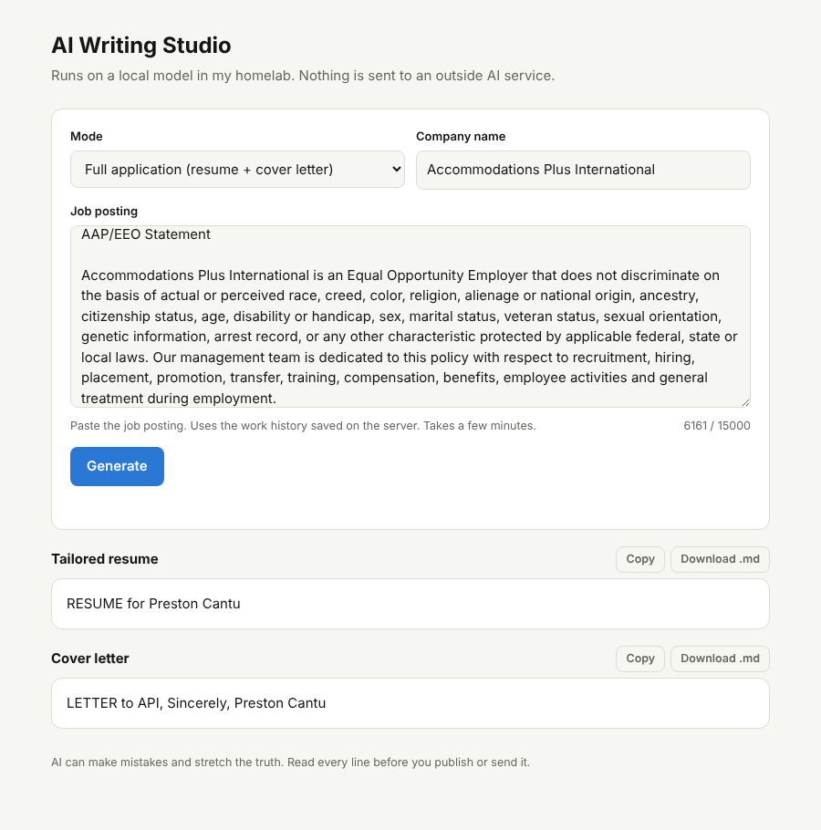

# AI Writing Studio

Local AI writing and job-application tools powered by Ollama and Qwen 3.6. Everything runs in my homelab, and no text is sent to an outside AI service.



## What's inside

```
ai-writing-studio/
├── app.py                      Web app (Flask) - every tool in one page
├── templates/index.html        The web page
├── requirements.txt
├── work_history.example.json   Template for your work history (the real one is never committed)
├── cli/                        Command-line versions of the tools, for running on a PC
│   ├── hello_ollama.py         Chat with the model / test the connection
│   ├── writing_studio.py       Blog, email, captions, rewrite
│   ├── repurpose.py            One piece -> thread, LinkedIn, newsletter, Instagram
│   ├── tailor_resume.py        Tailored resume from work_history.json + a job posting
│   ├── cover_letter.py         Cover letter from work_history.json + a job posting
│   └── apply.py                Resume + cover letter into a folder for each company
└── deploy/                     Ansible playbook + systemd unit to run the web app on a homelab node
```

## Web app modes

The writing tools at `/` are public. The job tools at `/jobs` are private behind a Cloudflare Access login, and the app verifies the login token itself.

| Group | Mode | Input |
|---|---|---|
| Writing | Blog post, Email, Social captions, Rewrite | Your text or idea, plus an optional tone |
| Writing | Repurpose | One piece of content → 4 formats |
| Job applications | Full application | Job posting + company → resume and cover letter |
| Job applications | Tailored resume / Cover letter | Job posting (+ company for the letter) |

Every result has **Copy** and **Download .md** buttons.

## Run the CLI tools on a PC

```
pip install requests
cd cli
python hello_ollama.py
python writing_studio.py blog "Why Security+ matters" casual
python repurpose.py my_post.md
copy ..\work_history.example.json work_history.json    (then fill in your real info)
python apply.py job.txt "Company Name"
```

## Deploy the web app to the homelab

See [SETUP.md](SETUP.md): Ansible deploy to node3, Cloudflare Tunnel, Cloudflare Access login, rate limiting, and monitoring.

## Privacy

- `work_history.json` and job postings are in `.gitignore`.
- On the server, the work history is deployed from Ansible Vault and readable only by the service user.
- `/jobs` and `/api/job` sit behind Cloudflare Access, and the app checks the signed Access token. Only approved emails can generate resumes from your work history.
- The public writing tools have per-IP rate limits and input limits.

## Lessons learned

- Turn off "thinking" (`"think": false`) for faster answers. Give the model a big enough context (`num_ctx`), or long answers can come back blank.
- Always open files with `encoding="utf-8"` on Windows.
- Even with strict "don't invent anything" rules, the model stretches the truth. Read every line before sending.
